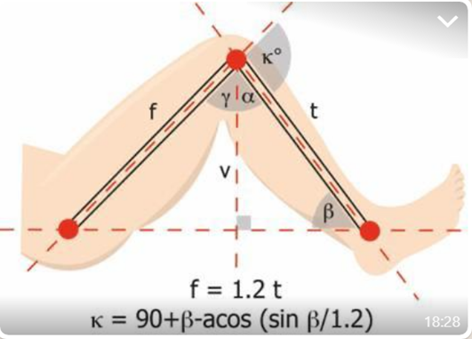

```{r setup, include=FALSE}
knitr::opts_chunk$set(echo = TRUE)
```

## Introduction

An [MIT App Inventor](https://appinventor.mit.edu/) sample app to enable self-measurement of knee range-of-motion. The app is developed to accompany the paper, "Feasibility, reliability and validity of self-measurement of knee range-of-motion using an accelerometer-based smartphone application by patients with Total Knee Arthroplasty."    


## Theory
The smartphone app converts accelerometer-derived shank angle ($\beta$) to knee flexion angle ($\kappa$) using the trigonometric function described by [Ockendon & Gilbert[^1]](https://pubmed.ncbi.nlm.nih.gov/23150162/)

```{r, echo = FALSE}

```


[^1]: Ockendon M, Gilbert RE. Validation of a novel smartphone accelerometer-based knee goniometer. J Knee Surg. 2012;25(4):341-345. doi:10.1055/s-0031-1299669

## Installation
Option 1: Scan the QR code and the app will be downloaded onto your device.   

Option 2: Download `Sample_Knee_ROM_App.apk` and install file in your device.   

```{r, echo = FALSE}

```
 

 
